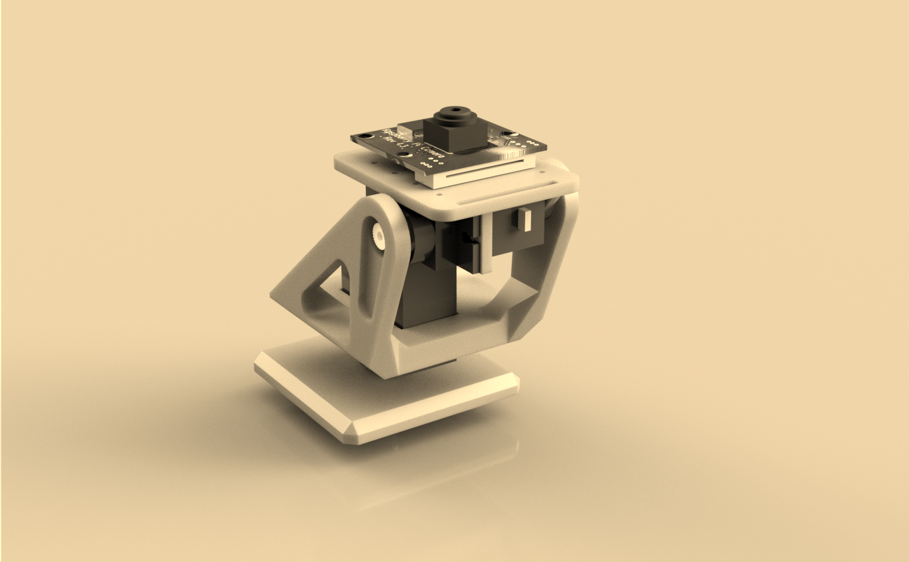

# Assignment: Sepia filter in C and Assembly

Фильтр сепия на C и Ассемблере

# Реализация

- Реализация на языке ассемблера использует векторные инструкции процессора SSE, за счет чего получено ускорение по сравнению с реализацией на C.
- Написаны тесты, которые сравнивают время работы двух реализаций.

# Сравнение времени работы (для запуска сравнения флаг не нужен)

```
Average ASM execution time (ms): 16.785000
Average C execution time (ms): 28.125000
-------------------------------------
The resulting acceleration 1.675603
```


```
Average ASM execution time (ms): 17.750000
Average C execution time (ms): 25.000000
-------------------------------------
The resulting acceleration 1.408450
```


```
Average ASM execution time (ms): 20.105000
Average C execution time (ms): 28.125000
-------------------------------------
The resulting acceleration 1.398905
```


# Фильтр на C (запускать с флагом `c`)


# Фильтр на ASM (запускать с флагом `a`)

